# Practica servidor web
## 1. Titulo
Creación de Servidores Web Personalizados con Docker y Nginx
## 2. Tiempo de duración
120 minutos.
## 3. Fundamentos:

La práctica realizada se basa en el uso de contenedores Docker para desplegar servidores web utilizando la imagen oficial de Nginx. Para comprender esta actividad, es esencial conocer los conceptos de contenedorización, Docker y Nginx.

Docker es una plataforma de código abierto que permite automatizar el despliegue de aplicaciones dentro de contenedores. Un contenedor es una unidad ligera y portable que contiene todo lo necesario para ejecutar una aplicación: el código, librerías, dependencias y configuraciones. A diferencia de las máquinas virtuales, los contenedores no necesitan un sistema operativo completo, lo que reduce significativamente el consumo de recursos y mejora la eficiencia.

Nginx, por su parte, es un servidor web de alto rendimiento que también puede funcionar como proxy inverso, equilibrador de carga o servidor de correo. En esta práctica, se utiliza Nginx para servir contenido web estático mediante archivos HTML editados por el usuario.

La combinación de Docker y Nginx permite simular el despliegue de múltiples servidores web de forma rápida y aislada. Cada servidor se ejecuta en su propio contenedor y expone un puerto diferente en el sistema anfitrión, permitiendo así acceder a ellos de forma independiente. En el primer contenedor se presenta información institucional, mientras que en el segundo se muestra información personal del estudiante.

Este enfoque es ampliamente utilizado en la industria del desarrollo web y DevOps, ya que permite probar y desplegar aplicaciones de forma segura, flexible y eficiente. Además, fomenta el aprendizaje práctico sobre cómo funciona un servidor web, cómo se personaliza su contenido, y cómo se gestionan contenedores desde la línea de comandos.

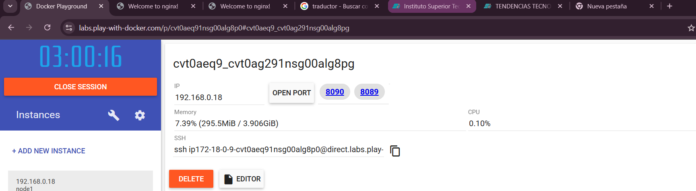

## 4. Conocimientos previos.
   
Para realizar esta practica el estudiante necesita tener claro los siguientes temas:
- Conceptos básicos de virtualización y contenedores
- Línea de comandos (CLI)
- Uso de Docker
- Estructura básica de un servidor web
- Edición de archivos en entornos Linux

## 5. Objetivos a alcanzar
   
- Implementar contenedores utilizando la imagen oficial de Nginx mediante Docker.
- Manipular y editar archivos de configuración dentro de los contenedores (por ejemplo, index.html).
- Personalizar el contenido web que se despliega desde cada servidor.
- Exponer puertos específicos para acceder a múltiples contenedores desde el navegador.
- Comprender el funcionamiento de un servidor web básico dentro de un entorno aislado.
- Aplicar comandos esenciales de Docker para la administración de contenedores.
- Reforzar el uso de herramientas de línea de comandos para la gestión de servicios web.

  
## 6. Equipo necesario:
  
- Computador con sistema operativo Windows/Linux/Mac.
- Acceso a internet estable para descargar imágenes y trabajar en línea.

## 7. Material de apoyo.
   
- Documentación oficial de Docker
- Guía de la asignatura proporcionada por el docente
- Cheat sheet de comandos básicos de Linux
- Tutoriales de introducción a Nginx
- Videos educativos sobre el uso de contenedores Docker
- Foros y comunidades como Stack Overflow y Docker Community

## 8. Procedimiento
### Paso 1: Crea el primer contenedor Nginx llamado johanginx1 exponiendo el puerto 8089.
Se inicia el contenedor johanginx1 en segundo plano, exponiendo el puerto interno 80 en el 8089 del host para acceder al servidor web.
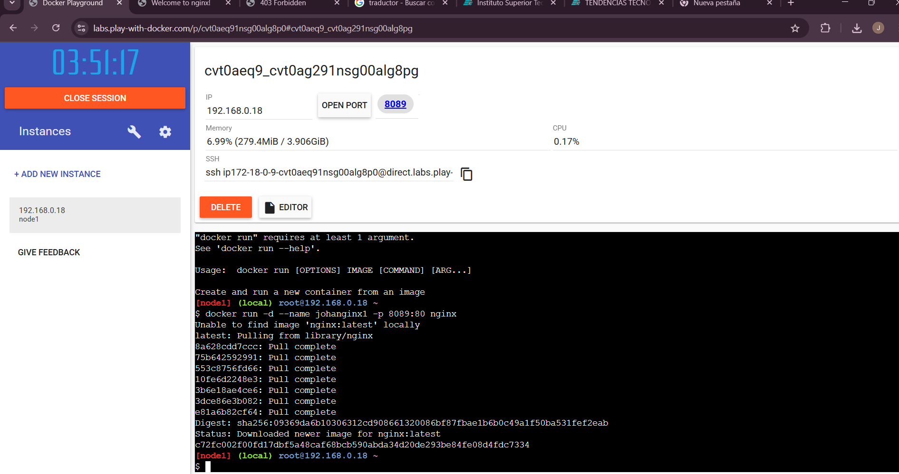

### Paso 2: Crea el segundo contenedor Nginx llamado nginx2 exponiendo el puerto 8090.
Se inicia el contenedor johanginx2 en segundo plano, exponiendo el puerto interno 80 en el 8090 del host para acceder al servidor web.

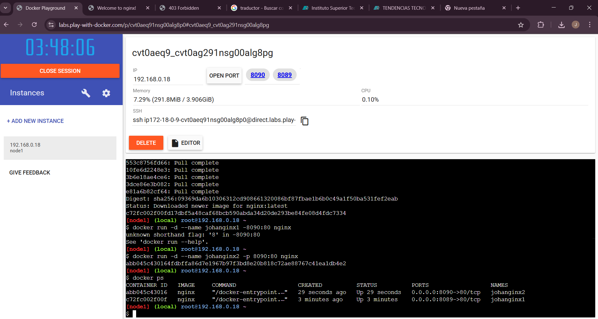

### Paso 3: Copia el archivo index.html desde el contenedor johanginx1 al sistema anfitrión.
Se copia el archivo index.html desde el contenedor johanginx1 al host como index1.html.
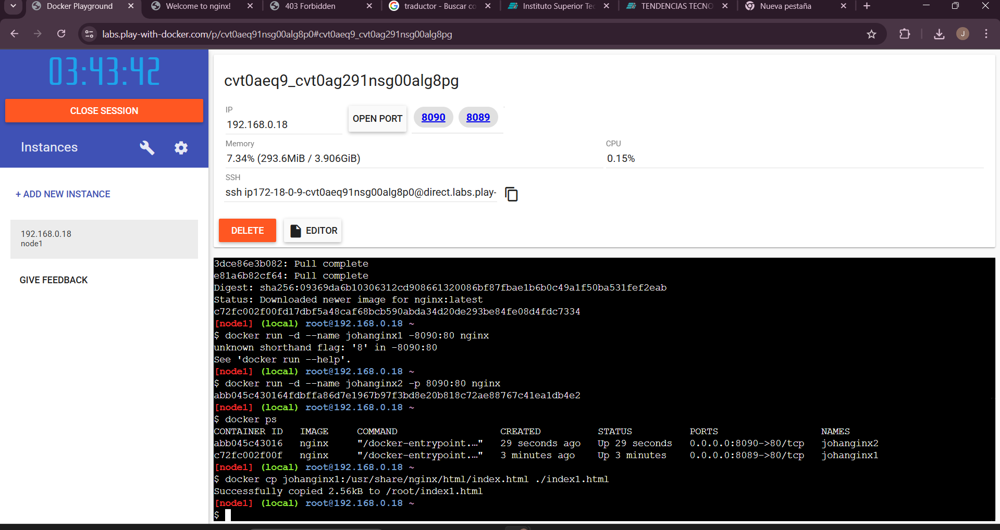

### Paso 4: Edita el archivo index1.html con un editor ocupamos vi, sobre la información del instituto.
Se edita el archivo index1.html con un editor para agregar información del instituto.
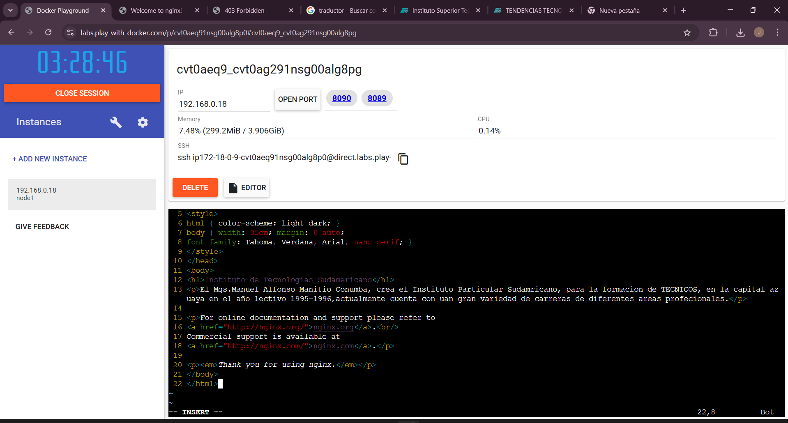

### Paso 5: Copia el archivo editado nuevamente al contenedor johanginx1.
Se reemplaza el index.html del contenedor nginx1 con la versión editada desde el host.
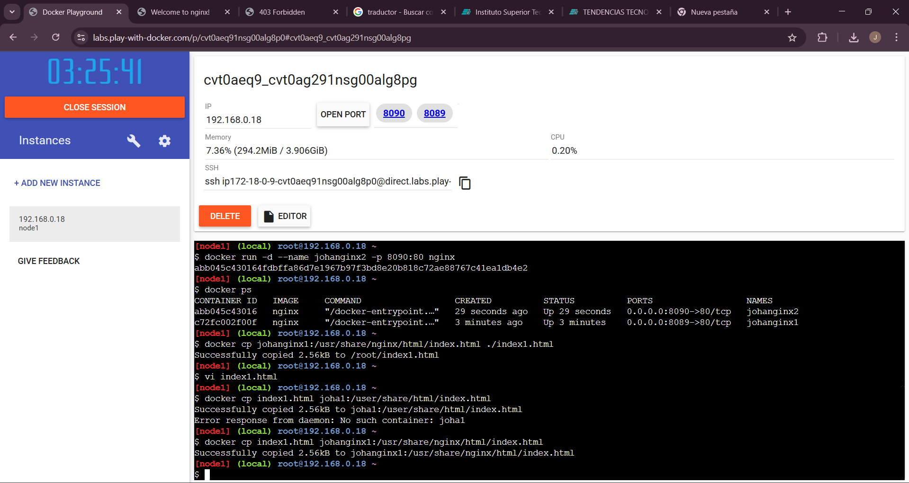
Finalmente la pagina editada con la infomcaion del instituto.
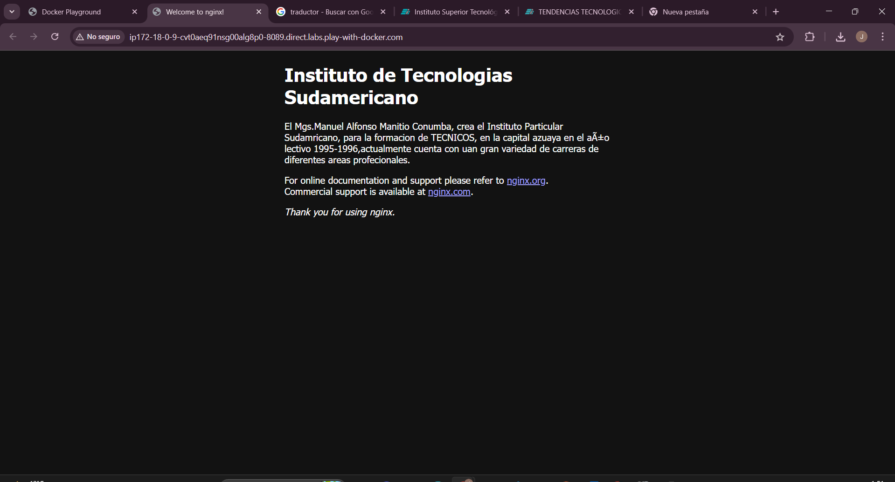

### Paso 6: Repite el proceso para johanginx2.
Ahora procedemos a hacer todos los pasos que se realizo con johanginx1 para johanginx2.
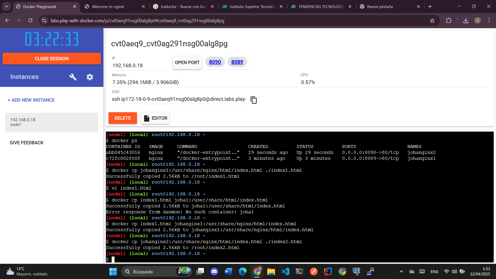
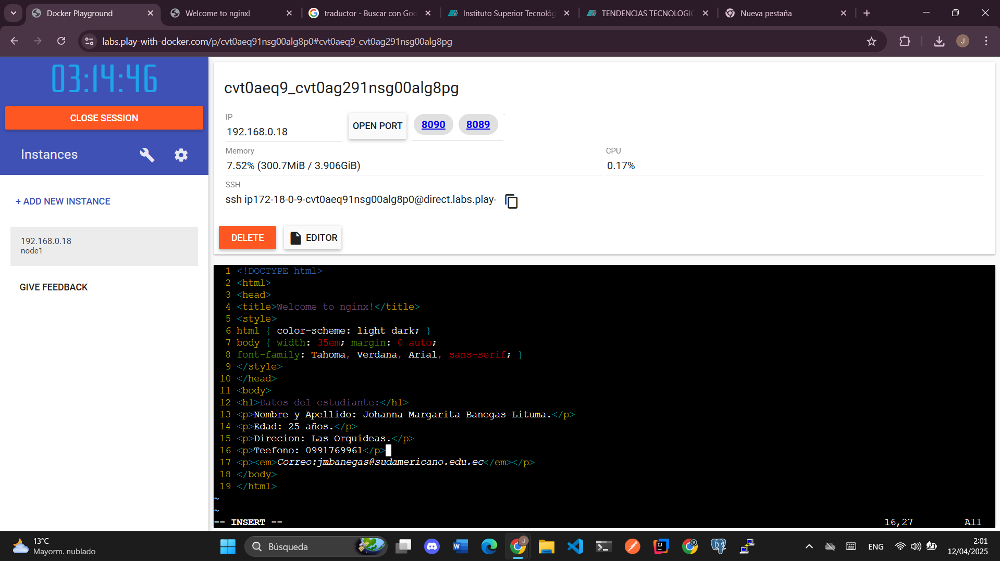
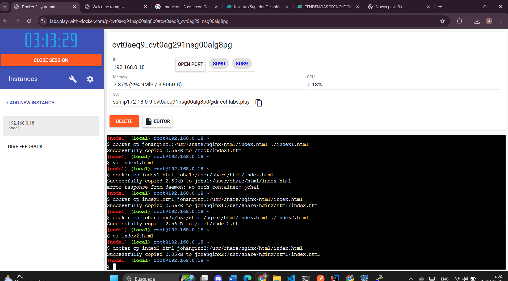
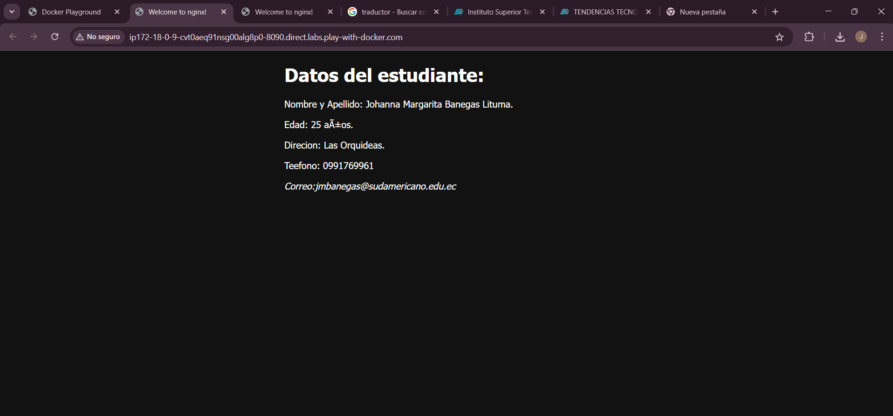

## 9. Resultados esperados:
Ambos contenedores Nginx (nginx1 y nginx2) se ejecutaron sin problemas, cada uno mostrando su propia página web a través de los puertos 8089 y 8090. Los cambios hechos en el archivo index.html se reflejan correctamente en cada contenedor, mostrando la información correspondiente.

## 10. Bibliografía
Docker Inc. (2024). Docker Documentation. Recuperado de https://docs.docker.com/
Nginx Inc. (2024). NGINX Documentation. Recuperado de https://www.nginx.com/resources/wiki/
Negus, C. (2020). Docker for Dummies. Wiley.
Shotts, W. E. (2019). The Linux Command Line: A Complete Introduction (2.ª ed.). No Starch Press.
Stack Overflow. (2024). Docker & Linux discussions. Recuperado de https://stackoverflow.com/
